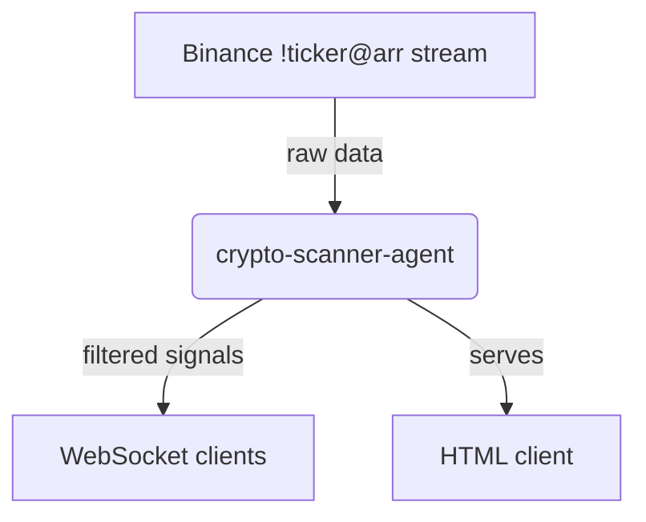

# crypto-scanner-agent

This project is a minimal Axum application that streams cryptocurrency gainers over WebSocket.
Incoming data is pulled from the Binance `!ticker@arr` feed and filtered server side before being broadcast to any connected clients.
A small example client is served from the `static` directory.



## Prerequisites

- Install [Rust](https://www.rust-lang.org/tools/install).
- (Optional) Install the Shuttle CLI if you want to use Shuttle's local runner: `cargo install cargo-shuttle`.

## API Keys

The Binance stream used here is public, so **no API keys are required**. The application works out of the box without further configuration.

## Running the Server

1. Clone this repository and change into its directory:
   ```bash
   git clone <this-repo-url>
   cd crypto-scanner-agent
   ```
2. Build and start the service with Cargo:
   ```bash
   cargo run --release
   ```
   By default the server listens on `127.0.0.1:8000`. It exposes a WebSocket endpoint at `/websocket` and serves a basic HTML client at the root path.
3. Visit `http://localhost:8000/` in your browser to see the live feed. Each message shows a coin symbol and volume information whenever the 24h price increase exceeds 5% and the quote volume is above $1M.

### Running with Shuttle

If you have the Shuttle CLI installed, you can alternatively run
```bash
cargo shuttle run
```
which launches the application inside Shuttle's runtime. This mirrors how the service would run when deployed through Shuttle.

### Helper Scripts

For convenience, use the provided shell scripts to run or deploy via Shuttle.

```bash
./run.sh
```
Runs the service locally using `shuttle run` and the `Secrets.toml` file in the repository root.

```bash
./deploy.sh
```
Deploys the application to Shuttle using the same secrets file.

## Formatting and Linting

Rust code in this repository follows the standard formatting and linting tools provided by Cargo.

```bash
./format.sh  # runs `cargo fmt --all`
./lint.sh    # runs `cargo clippy --all-targets --all-features -- -D warnings`
```

You can also invoke them directly:

```bash
cargo fmt --all
cargo clippy --all-targets --all-features -- -D warnings
```

## Running Tests

Execute the unit tests with Cargo:

```bash
cargo test
```

## Examples

Two optional binaries demonstrate how to call DeepSeek outside of the
crypto gainer service:

- `sentiment` showcases running several extraction agents in parallel.
- `calculator` illustrates using DeepSeek tools for simple arithmetic.

When issuing multiple DeepSeek requests, the examples leverage
`futures::stream::iter` with `buffer_unordered` to run calls concurrently.
Successful responses are cached so repeated runs avoid unnecessary network
traffic.

## Canonical Cargo Commands

The helper scripts above are optional. You can perform the same tasks using
standard Cargo commands:

```bash
# start the server
cargo run --release

# run the sentiment example
cargo run --bin sentiment --release


# run the calculator example (optional)
cargo run --bin calculator --release

# deploy with Shuttle
cargo shuttle deploy -- --secrets backend/Secrets.toml
```

